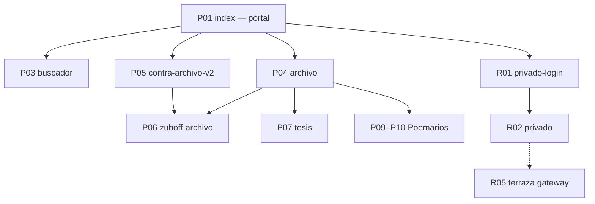

# Inventario de contenidos — Base de arquitectura de información

> **Repositorio:** [vientonorte/antropologia-corrupcion](https://github.com/vientonorte/antropologia-corrupcion)  
> **Sitio público:** https://vientonorte.github.io/antropologia-corrupcion/  
> **Fuente de verdad del deploy:** `web/` (promovida a raíz vía `rsync` en CI)  
> **Versión:** 2026-06-28 · **Mantenedor:** Colectivo Viento Norte

Este documento es la **base angular** de la arquitectura de información (IA). Todo cambio de navegación, sitemap, card sorting o nueva superficie debe reconciliarse aquí antes de implementarse.

**Compañeros machine-readable:**
- `data/ia-inventario.json` — mapa de superficies y relaciones
- `data/archivo-index.json` — índice editorial publicable
- `xml/sitemap.xml` — URLs indexables

---

## 1. Resumen ejecutivo

| Dimensión | Valor |
|---|---|
| Páginas HTML en `web/` | 20 |
| Superficies de contenido real (público) | 12 |
| Redirects / stubs | 5 |
| Superficies privadas o restringidas | 5 |
| Archivos JSON en `data/` | 13 |
| Fichas markdown (`docs/fichas/`) | 4 + README |
| Imágenes públicas (`img/`) | 11 |
| Módulos JS (`src/`) | 17 |

### Tres contextos del repositorio

| Contexto | Ubicación | ¿En GitHub Pages? |
|---|---|---|
| Sitio estático público | `web/` + `data/` + `src/` + `img/` | Sí |
| Investigación autenticada | `privado-login.html`, `privado.html`, `archivo-lecturas.html` | Sí (con restricciones) |
| Producción doctoral | `web/terraza/` (Next.js), `admin.html` | No (gateway estático en `/terraza/`) |
| Archivo pesado de tesis | `Estado del Arte/`, `docs/Ensayo Traducción de Saberes/` (canónico D4), `docs/` | No |

---

## 2. Taxonomía IA (categorías de primer nivel)

```
Contra-Archivo
├── 1. Entrada y descubrimiento      → index.html (portal Contra-archivo)
├── 2. Exploración de datos            → buscador (fuentes oficiales + fricción)
├── 3. Instrumento analítico           → contra-archivo-v2 (narrativa · grafo · biblioteca)
├── 4. Archivo editorial             → archivo (hub fichas · citas · poemarios)
├── 5. Corpus y citas                → zuboff-archivo (Zuboff · ATTAC · Clave B)
├── 6. Publicaciones                 → tesis · Poemarios
├── 7. Acceso investigador           → privado-login → privado / archivo-lecturas
└── 8. Producción (no público)       → terraza (Next.js) · admin (local)
```

### Ejes transversales (codificación, no páginas)

| Eje | Esquema | Fuente |
|---|---|---|
| 3 capas de verdad | ética · institucional · material | `data/casos.json` |
| 7 dimensiones | D1–D7 (jurisdicción → visibilidad) | `docs/fichas/README.md` |
| 4 ejes narrativos | Seguridad · Finanzas · Territorio · Metodología | `contra-archivo-v2.html` |
| 6 fuentes MVP | InfoLobby · Transparencia · BCN · SEIA · ComprasPúblicas · CMF | `data/fuentes-oficiales.json` |

---

## 3. Inventario de superficies HTML

### 3.1 Público — núcleo navegable

| ID | Archivo | URL | Título | Propósito | Audiencia | Nav global | Sitemap |
|---|---|---|---|---|---|---|---|
| P01 | `web/index.html` | `/` | Contra-archivo | **Portal canónico.** Rutas grafo/leer/buscar, demo fricción, métricas corpus, grafo lazy | Público | Inicio | 1.0 |
| P03 | `web/buscador.html` | `/buscador.html` | Búsqueda Avanzada | 5 categorías E–I, deep-links `?q=`/`?fuente=`, strip fuentes, huella digital | Avanzado | Búsqueda | 0.85 |
| P04 | `web/archivo.html` | `/archivo.html` | Archivo público | Hub desde `archivo-index.json`: fichas, citas, biblioteca, poemarios | Académico | Archivo | 0.85 |
| P05 | `web/contra-archivo-v2.html` | `/contra-archivo-v2.html` | Negra Colorá | Instrumento: Leer · Explorar · Consultar; grafo 37 nodos | Público · comité | Secundaria | 0.9 |
| P06 | `web/zuboff-archivo.html` | `/zuboff-archivo.html` | ⑤ Archivo de Citas | Corpus Zuboff+ATTAC, Clave B, OCR/IA, export | Metodológico | Desde archivo/v2 | 0.85 |
| P07 | `web/tesis.html` | `/tesis.html` | Biblioteca de Tesis | Catálogo filtrable; PDF completo con passkey | Visitante | Biblioteca | 0.75 |
| P08 | `web/404.html` | `/404.html` | 404 | Error + enlaces recuperación | Todos | — | — |

### 3.2 Público — Poemarios

| ID | Archivo | URL | Propósito | Sitemap |
|---|---|---|---|---|
| P09 | `web/Poemarios/poemas.html` | `/Poemarios/poemas.html` | Índice poesía como método | 0.6 |
| P10 | `web/Poemarios/trabajo-en-sura.html` | `/Poemarios/trabajo-en-sura.html` | Performance scroll SURA (19+ secciones) | 0.55 |
| P11 | `web/Poemarios/index.html` | `/Poemarios/` | Redirect → `poemas.html` | — |

### 3.3 Redirects

| Archivo | Destino | Motivo |
|---|---|---|
| `web/login.html` | `privado-login.html` | Login unificado |
| `web/contra-archivo.html` | `index.html` | Narrativa legacy absorbida |
| `web/citas-attac.html` | `zuboff-archivo.html` | Corpus ATTAC unificado |
| `web/zuboff-citas.html` | `zuboff-archivo.html` | Corpus Zuboff unificado |
| `web/Poemarios/index.html` | `poemas.html` | Índice poemarios |

### 3.4 Privado / restringido

| ID | Archivo | Propósito | Acceso | robots |
|---|---|---|---|---|
| R01 | `web/privado-login.html` | Passkey + fallback → `privado.html` | CTA «Acceder» | Allow |
| R02 | `web/privado.html` | Panel: Simulación · Chat · CIPER · Tesis · Huella | Sesión passkey | Disallow |
| R03 | `web/archivo-lecturas.html` | Citas Clave A/B; captura, OCR, export | Login redirect | noindex |
| R04 | `web/admin.html` | CMS legacy dimensiones | Solo local (bloqueado en `*.github.io`) | Disallow |
| R05 | `web/terraza-gateway.html` | Gateway → `/terraza/` en Pages | Informativo; app en `npm run dev` | noindex |

### 3.5 App no publicada — `web/terraza/`

| Ruta local | Módulo |
|---|---|
| `/login`, `/register` | Autenticación passkey |
| `/corpus` | Listado y edición fichas |
| `/upload` | Ingesta capturas |
| `/codificacion` | Kanban GT |
| `/grafo` | Visualización relaciones |
| `/sistema` | Salud APIs · cola commits |

---

## 4. Capa de datos (`data/`)

| Archivo | Alimenta | Contenido |
|---|---|---|
| `casos.json` | Grafo, buscador, index, privado | 7 casos + nodos + 4 enlaces transversales |
| `fuentes-oficiales.json` | buscador, index, export | 38 registros fuentes oficiales (+ BCN normalizado) |
| `bcn-legislativo.json` | Búsqueda cat. H | Boletines BCN |
| `fuentes-config.json` | Tests, registry, **bases consultadas UI** | Endpoints, pipeline mvp/fase-2, normalizadores |
| `archivo-index.json` | `archivo.html`, `index.html` (resource grid) | 10+ entradas editoriales publicables |
| `zuboff-citas.json` | zuboff-archivo | Citas Zuboff (ids 1001+) |
| `attac-citas.json` | zuboff-archivo | Citas ATTAC (ids 2001+) |
| `corpus-categorias.json` | zuboff-archivo | Taxonomía temática |
| `ai-proxy-config.json` | zuboff-archivo | Worker inferencia IA |
| `huella-digital-publica.json` | privado tab Huella | Entidades y trazas semilla |
| `contenido-ramas-rescatado.json` | privado tab Chat | Secciones académicas rescatadas |
| `grafo-nodos.json` | Pipeline offline | Export fichas (no cableado HTML) |
| `grafo-edges.json` | Pipeline offline | Aristas exportadas |
| `ia-inventario.json` | Nav · QA · docs | Mapa IA machine-readable |

### Casos en `casos.json`

1. `sura-gobernanza-datos` (2024)
2. `la-negra-territorio-mapuche` (2023)
3. `periodismo-datos-chile` (2023)
4. `oit169-consulta-previa` (2022)
5. `banca-roles-opacidad-digital` (2024)
6. `michillanca-extractivismo-ley-anti` (2018)
7. `ensayo-traduccion-saberes` (2026, D4)

---

## 5. Fichas (`docs/fichas/`)

| Ficha | Tipo | Estado | En `archivo-index` | En `archivo.html` |
|---|---|---|---|---|
| `C01-nucleo-margen.md` | Conceptual | publicable | ✅ | ✅ |
| `C02-sistema-pensiones-archivo.md` | Sistema | publicable | ✅ | ✅ |
| `C03-protocolo-documentacion.md` | Metodológica | investigador | README interno | ❌ |
| `C04-bomba-viento-norte.md` | Caso/poética | en revisión | ✅ | ✅ (poemario) |
| `C05-michillanca-extractivismo-ley-anti.md` | Caso etnográfico | publicable | ✅ | ✅ |
| `README.md` | Operación | investigador | ✅ (interno) | ❌ |

> Las fichas viven en GitHub; no se despliegan como HTML en Pages. El hub público es `archivo.html` + enlaces raw.

---

## 6. Media y módulos

### `img/` (público)

Infografías de ejes I–III en `contra-archivo-v2.html`; `evidencia-reservada.svg` (placeholder); OG image en meta tags.

### `src/` (público, validado en deploy)

`passkey.js`, `searchEngine.js`, `frictionEngine.js`, `main.js`, `graph.js`, `socialField.js`, `ciperFeed.js`, `exportPipeline.js`, etc.

### `web/styles/`

`shared.css` (tokens + nav), `graph.css`, `contra-archivo.css`, `ui-kit.css`

---

## 7. Mapa de relaciones



### Hubs

| Hub | Rol IA |
|---|---|
| `index.html` | **Portal público** — rutas de entrada, demo fricción, búsqueda preliminar, grafo |
| `archivo.html` | **Catálogo editorial** — fichas, corpus, biblioteca, poemarios |
| `contra-archivo-v2.html` | **Instrumento** — narrativa + grafo + biblioteca embebida |

### Huérfanos / deuda

| Superficie | Problema |
|---|---|
| `index.html` | Duplica landing; nav dice «Instrumento» pero el instrumento es v2 |
| `archivo-lecturas.html` | Sin nav global; solapa con zuboff-archivo |
| C03, C04 | Producidas pero no en índice público |
| `grafo-*.json` | Generados, no consumidos por front |

---

## 8. User journeys

### A. Público general

```
index → demo fricción / búsqueda preliminar → buscador (profundizar con `?q=`)
       → archivo (descubrir) → contra-archivo-v2 (narrativa/grafo)
       → tesis / Poemarios (lectura)
```

### B. Investigador/a

```
privado-login (passkey) → privado
  ├─ Simulación (grafo + entropía)
  ├─ Chat/síntesis (contenido-ramas-rescatado.json)
  ├─ Noticias/CIPER
  ├─ Tesis/documentos
  └─ Huella digital
→ archivo-lecturas (Clave A/B) · zuboff-archivo (corpus local)
```

### C. Producción

```
Local: web/terraza && npm run dev → corpus · upload · codificación · grafo · sistema
Pages: /terraza/ → gateway informativo
Legacy: admin.html (solo no-github.io)
```

---

## 9. Navegación primaria propuesta

Esta es la **nav objetivo** derivada del inventario (no necesariamente implementada aún):

| Label | Destino | Categoría IA |
|---|---|---|
| Inicio | `index.html` | 1 |
| Explorar datos | `buscador.html` | 2 |
| Contra-archivo | `contra-archivo-v2.html#leer` | 3 |
| Archivo | `archivo.html` | 4 |
| Corpus citas | `zuboff-archivo.html` | 5 |
| Biblioteca | `tesis.html` | 6 |
| Acceder → | `privado-login.html` | 7 |

**Nav contextual en v2:** `Narrativa | Grafo | Biblioteca | ⑤ Zuboff`

---

## 10. Brechas IA y backlog

| # | Brecha | Prioridad | Acción sugerida |
|---|---|---|---|
| B1 | `index` ≠ instrumento | Alta | Nav «Instrumento» → `contra-archivo-v2.html` o fusionar index/landing |
| B2 | Dos navs (shell vs v2) | Media | Unificar `shared-shell.js` con labels propuestos §9 |
| B3 | `archivo-lecturas` huérfana | Media | Enlazar desde privado o merge con zuboff |
| B4 | Fichas C03/C04 invisibles | Media | Actualizar `archivo-index.json` |
| B5 | Sitemap triplica home | Baja | Canonical único: `/landing.html` |
| B6 | `manifest.json` start_url `/` | Baja | Apuntar a `landing.html` |
| B7 | README anchors obsoletos | Baja | Alinear con modos v2 |

---

## 11. Deploy y exclusiones

**Workflow:** `.github/workflows/deploy.yml`

1. Tests + `qa-links.mjs --local`
2. `rsync web/ → raíz` (excluye `terraza/`)
3. `terraza-gateway.html` → `terraza/index.html`
4. Elimina `web/`, `Estado del Arte/`, `Ensayo…`, `docs/`
5. Valida `src/`, `styles/`, `data/`, `img/`
6. Deploy Pages

**No publicado:** `docs/` (este inventario), fichas markdown, app Terraza, archivo masivo de tesis.

---

## 11b. D4 — Ensayo Traducción de Saberes (reorganizado 2026-06-20)

> **Canónico local:** `docs/Ensayo Traducción de Saberes/` · **Índice:** `data/ensayo-traduccion-index.json`  
> **Valor narrativo:** [`docs/VALOR_NARRATIVO_D4_ENSAYO.md`](VALOR_NARRATIVO_D4_ENSAYO.md) · deuda **B9**

| Pieza | Valor | Canónico | En `web/` |
|---|---|---|---|
| Artículo «La máquina de fabricar enemigos» | **Crítico** | `textos-canonicos/articulo_etnografico.docx` | Solo resumen en v2 `#eje-1` |
| Ensayo teórico (mistranslation) | Alto | `Estado del Arte/…/README.md` | Parcial |
| Etnografía audiovisual | Alto | `textos-canonicos/*.pdf` | No |
| Corpus PDF (50+) | Medio–Alto | subcarpetas Marco/Bibliografía | Referenciado en grafo |

**Espejos obsoletos:** `docs/Estado del Arte/Ensayo…`, `docs/Estado del Arte/Proyectos/Ensayo…`, `Ensayo Traducción de Saberes/contra-archivo.html` (raíz).

---

## 12. Excluidos — `_papelera_duplicados/` (solo local)

> **Ruta:** `_papelera_duplicados/` · **Git:** en `.gitignore` (no está en GitHub ni en Pages)  
> **Prefijo `EA_`:** copias sacadas del árbol activo durante limpieza de duplicados (*Estado del Arte* / raíz pre-`web/`).  
> **Decisión documentada:** `skills/QUICK_WINS_PRODUCCION.md` → eliminar cuando no hagan falta como referencia.  
> **Valor narrativo (auditoría 2026-06-20):** [`docs/VALOR_NARRATIVO_PAPELERA.md`](VALOR_NARRATIVO_PAPELERA.md) · deuda **B8** en `ia-inventario.json`

| Archivo papelera | Canónico actual | Fecha snapshot | Estado vs canónico |
|---|---|---|---|
| `EA_admin.html` | `web/admin.html` (R04) | 2026-05-18 | **Obsoleto** — sin `noindex`, sin bloqueo `*.github.io`, sin CSS responsive móvil |
| `EA_index.html` | `web/index.html` (P02) | 2026-05-18 | **Obsoleto** — sin `canonical` → landing, nav/OG desactualizados |
| `EA_contra-archivo-v2.html` | `web/contra-archivo-v2.html` (P05) | 2026-05-18 | **Obsoleto** — ~1.5 MB vs ~3.7k líneas actuales; sin `socialField.js`, sin fixes grafo móvil |
| `EA_contra-archivo-v1-DEPRECATED.html` | `web/contra-archivo.html` → redirect `index.html` | 2026-05-18 | **Deprecado** — narrativa v1 (~1.6k líneas); reemplazada por v2 |

### Regla IA

- **No indexar** en sitemap, `ia-inventario.json` ni nav.
- **No restaurar** a `web/` sin diff explícito contra el canónico.
- **Seguro borrar** en disco local si ya no necesitas comparar historial (el historial git del canónico vive en `web/`).

Si reaparecen duplicados en raíz post-rsync, mover aquí o eliminar — la fuente de verdad del deploy es siempre `web/`.

---

## 13. Mantenimiento del inventario

Al agregar contenido:

1. Registrar superficie en **§3** y en `data/ia-inventario.json`
2. Si es editorial publicable → `data/archivo-index.json`
3. Si es indexable → `xml/sitemap.xml`
4. Si es privado → `xml/robots.txt` + `SECURITY.md`
5. Actualizar fecha en `_meta.version` de los JSON

**Referencias:** `PIPELINE.md` · `SECURITY.md` · `docs/MOBILE_FIRST_QA.md` · `docs/fichas/README.md`